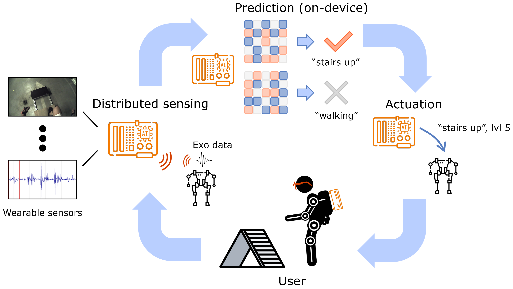
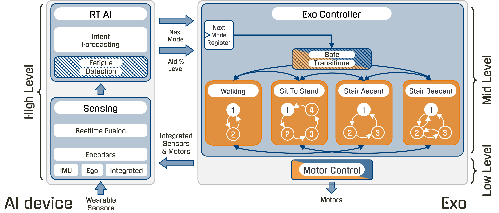
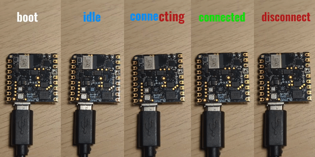

# AidFOG
Exoskeleton controller, wrapped with KU Leuven's [HERMES](https://github.com/maximyudayev/hermes) framework to communicate to an external AI controller for intent-based locomotion mode selection and fatigue-based support level moderation.

The exo uses a hierarchical controller, with each layer controlling the layer below it:
- High-level -> AI-based intent (ambulation mode) and fatigue forecasting
- Mid-level -> intra-mode normative kinematics trajectory tracking
- Low-level -> field-oriented motor control

<p align="center">
  
  
</p>

These mid-level state machines are defined based on the derived locomotion kinematic equations for the specific rigid body, within the degrees-of-freedom it offers, to track a desired normative motion trajectory with a desired frequency response of the control system.

## Structure
The cueing-specific files:
```
├──hermes/
│  ...
│  ├──aidfog_cli/
│  │  ├──producer.py
│  │  └──stream.py
│  ├──aidfog_ai/
│  │  ├──ai_utils.py
│  │  ├──pipeline.py
│  │  └──stream.py
│  ...
│  └──aidfog/
│     ├──controller/
│     │  ├──buds_facade.py
│     │  └──buds_handler.py
│     ├──utils/
│     │  ├──types.py
│     │  └──utilities.py
│     ├──pipeline.py
│     └──stream.py
...
└──buds_firmware/
```
### Pine Buds Pro
 - `buds_handler.py` is the main AsyncIO routine that manages the functionality of the buds system:
    1. Manages a persistent BLE connection to the Pine Buds Pro via `BudsBleBackend`;
    2. Polls the cueing command queue (fed by the HERMES pipeline) and forwards `start`, `stop`, and `configure` commands to the earbud over BLE GATT;
    3. Periodically samples earbud status and pushes timestamped readings to the status queue for HERMES to log;
    4. On shutdown (`is_cleanup_event`), stops all internal coroutines, sends a final STOP command, disconnects BLE, then sets `is_finished_event`.
 - `types.py` defines convenience datatypes that ensure safe typing between different coupled components of the system.
 - `utilities.py` shared static logic, reusable by multiple distinct components.

#### IO
 - `buds_facade.py` decouples specific BLE GATT commands with PineBuds as an API, handling discovery, connection, reconnection, and status notifications.

## BLE Cueing Packet Format

All messages are transmitted over the **Cueing GATT Characteristic** (`ac000002-…`).
Each packet begins with a 1-byte opcode; field widths are shown proportionally.

### Host → Earbud (commands written to `CUE_CMD_CHAR`)

**START** — trigger a cue immediately (3 bytes)

```
  Byte 0        Byte 1        Byte 2
 ┌─────────────┬─────────────┬─────────────┐
 │  CMD (0x01) │   tone_id   │   volume    │
 │    u8       │    u8       │    u8       │
 └─────────────┴─────────────┴─────────────┘
   8 bits        8 bits        8 bits
```

**STOP** — halt any active cue (1 byte)

```
  Byte 0
 ┌─────────────┐
 │  CMD (0x02) │
 │    u8       │
 └─────────────┘
   8 bits
```

**CONFIGURE** — write cue parameters into the earbud before a `START` (8 bytes)

```
  Byte 0      Byte 1      Byte 2      Bytes 3–4         Byte 5      Bytes 6–7
 ┌───────────┬───────────┬───────────┬──────────────────┬───────────┬──────────────────┐
 │ CMD(0x03) │  tone_id  │  volume   │   duration_ms    │   count   │    gap_ms        │
 │    u8     │    u8     │    u8     │   u16 LE         │    u8     │   u16 LE         │
 └───────────┴───────────┴───────────┴──────────────────┴───────────┴──────────────────┘
   8 bits      8 bits      8 bits      16 bits             8 bits      16 bits
   ◄────────────────────── 64 bits total (8 bytes) ──────────────────────────────────►
```

| Field | Type | Range | Meaning |
| - | - | - | - |
| `tone_id` | `u8` | `0–255` | Selects the tone waveform stored on the earbud |
| `volume` | `u8` | `0–100` | Playback volume as a percentage |
| `duration_ms` | `u16 LE` | `0–65535` | Single burst on-time in milliseconds |
| `count` | `u8` | `1–255` | Number of burst repetitions |
| `gap_ms` | `u16 LE` | `0–65535` | Silence between bursts in milliseconds |

### Earbud → Host (notifications from `CUE_STATUS_CHAR`)

**STATUS** — pushed by the earbud on every state change (1 byte)

```
  Byte 0
 ┌──────────────────────────────────┐
 │              status              │
 │               u8                 │
 └──────────────────────────────────┘
   8 bits
   0x00 = IDLE  │  0x01 = CUEING  │  0xFF = ERROR
```

### HERMES
#### Pine Buds Pro
 - `aidfog/pipeline.py` HERMES Node integrating exoskeleton with the rest of the sensing and companion computing ecosystem.
 - `aidfog/stream.py` HERMES datastracture containing all the data generated by the exoskeleton.

#### (Option #1) Local shell terminal
 - `aidfog_cli/producer.py` HERMES Node enabling CLI based manual selection of intent [0, 4] and fatigue level [%0, %100] (must start from %, will autoclip values to 0-100 range), when using the exo in standalone mode.
 - `aidfog_cli/stream.py` HERMES datastracture containing all valid CLI entries of intent and fatigue.

#### (Option #3) Companion AI device
 - `aidfog_ai/pipeline.py` PyTorch model enabling automated selection of intent [0, 4] and fatigue level [0, 100], when using the exo in end-to-end automated approach.
 - `aidfog_ai/stream.py` HERMES datastracture containing all valid AI predictions of intent and fatigue.

## Installation
Create, activate, and configure a Python UV environment:
```bash
uv venv --python <desired version>
.venv/bin/activate
uv sync
```

# TODO: Have a decent README similar to this

### Nicla Sense ME
The `exo.yml` file offers an option to configure the system to use [BLE or I2C](exo.yml#L45) for communication with the onboard [Nicla motion sensors](https://docs.arduino.cc/hardware/nicla-sense-me/). The `device_mapping` must be correpsondingly selected (commented/uncommented) and updated with the correct MAC addresses (in the case of BLE).

Use [PlatformIO](https://platformio.org/) to program and debug the firmware as needed, instead of the limited Arduino IDE.

#### (Option #1) - `BLE`
Uses the `bleak` package on the Raspberry Pi to receive wireless Bluetooth Low Energy data packets from the Nicla Sense ME devices. Quality is subject to RF interference from other devices, throughput limitation, BLE issues, lack of continuous synchronization between devices.

The exo uses the integrated motion sensors in a "Push" strategy, where the sensors push the latest motion information into the exo, to drive its internal logic. The exo uses the most up-to-date and lowest latency kinematics knowledge, without any attempts at syncrhonizing data. This allows it to maintain tight soft realtime guarantees.

The [BLE firmware](sensors_firmware/nicla_ble/nicla_ble.ino) compiles with flags that enable desired modalities - by default, gyroscope and Euler orientation data.

The sensors visualize the state of the sensors with the onboard LED for easier troubleshooting and validation of the health of the exoskeleton.



> [!IMPORTANT]
> Current gyroscope + euler configuration (with 9 bytes of metadata) is 27 total bytes/packet, practically limited to 40Hz for 5 concurrently streaming wireless sensors - important for the bandwidth estimation of the mid-level controller and the overall system.

#### (Option #2) - `I2C`
The integrated motion and environment sensors are configured to use the [TWIS1](https://docs-be.nordicsemi.com/bundle/nRF52832_PS_v1.9/raw/resource/enus/nRF52832_PS_v1.9.pdf#%5B%7B%22num%22%3A776%2C%22gen%22%3A0%7D%2C%7B%22name%22%3A%22XYZ%22%7D%2C56.692%2C752.879%2Cnull%5D) peripheral for I2C communication, and exposed via the ESLOV connector.

Communicates to each Nicla Sense ME over a shared I2C bus on the [ESLOV connector (p.4)](https://docs.arduino.cc/resources/pinouts/ABX00050-full-pinout.pdf), via the Raspberry Pi's [`busio`](https://docs.circuitpython.org/en/latest/shared-bindings/busio) package.
To avoid polluting the I2C bus and wasting Pi's resources, each Nicla indicates via an interrupt that new data is available to be read.
The Raspberry Pi then accesses the corresponding device by its I2C address to retrieve the new (burst) data.

> [!IMPORTANT]
> Make sure to wire the INT pin (`P0_19`) of each of the Nicla's 5-pin ESLOV connectors to the Raspberry Pi's digital GPIO's [31](https://pinout.xyz/pinout/pin31_gpio6/), [11](https://pinout.xyz/pinout/pin11_gpio17/), [13](https://pinout.xyz/pinout/pin13_gpio27/), [15](https://pinout.xyz/pinout/pin15_gpio22/), and [16](https://pinout.xyz/pinout/pin16_gpio23/), in any order, but consistent with the specification in the [`exo.yml`](exo.yml#L54-L69) file. This does not conflict with the pin occupation of the attached [CAN-FD HAT](https://www.waveshare.com/wiki/2-CH_CAN_FD_HAT#Interfaces). E.g.:
> | Nicla | Raspberry Pi 5 pin | I2C address |
> | - | - | - |
> | `torso` | [GPIO6 (pin 31)](https://pinout.xyz/pinout/pin31_gpio6/) | 0x11 |
> | `thigh_right` | [GPIO17 (pin 11)](https://pinout.xyz/pinout/pin11_gpio17/) | 0x12 |
> | `shank_right` | [GPIO27 (pin 13)](https://pinout.xyz/pinout/pin13_gpio27/) | 0x13 |
> | `thigh_left` | [GPIO22 (pin 15)](https://pinout.xyz/pinout/pin15_gpio22/) | 0x14 |
> | `shank_left` | [GPIO23 (pin 16)](https://pinout.xyz/pinout/pin16_gpio23/) | 0x15 |

> [!IMPORTANT]
> Also make sure to flash each Nicla with the right firmware and uniquely addressable via the [`I2C_ADDRESS`](sensors_firmware/nicla_i2c/nicla_i2c.ino#L5) macro, consistent with the address specified in the `exo.yml` file.

The standard I2C interface on the Raspberry Pi 5 does not support clock stretching. Nicla's non-deterministic threaded processing does not timely detect the incoming I2C request and doesn't acknowledge transactions. Enable an alternative high-speed I2C interface on the Pi under by adding into the boot configuration file `/boot/firmware/config.txt`, and wiring SDA to [GPIO4 (pin 7)](https://pinout.xyz/pinout/pin7_gpio4/) and SCL to [GPIO5 (pin 29)](https://pinout.xyz/pinout/pin29_gpio5/), both of which conveniently do not interfere with the CAN-FD hat. No external pull-up resistors are needed.
```
dtoverlay=i2c2-pi5,pins_4_5,baudrate=400000
```

Restart and check if the kernel module is enabled with:
```bash
ls /dev/i2c-2
```

Install support tools for CLI-based verification. Will help detect if slave devices are not properly connected.
```bash
sudo apt-get install i2c-tools
```

Program all the Nicla devices in PlatformIO or Arduino IDE.
Run the convenient utility to detect if all devices are connected to the bus and are detected by the Pi:
```bash
i2cdetect -y 2
```

> [!WARNING]
> Verify signal integrity on the I2C bus. The wire harness packs SCL and SDA unshielded wires tightly together and at high clock speeds (400kHz) may cause cross-talk.

##### Nicla Sense ME
The integrated motion and environment sensors are configured to use the [TWIS1](https://docs-be.nordicsemi.com/bundle/nRF52832_PS_v1.9/raw/resource/enus/nRF52832_PS_v1.9.pdf#%5B%7B%22num%22%3A776%2C%22gen%22%3A0%7D%2C%7B%22name%22%3A%22XYZ%22%7D%2C56.692%2C752.879%2Cnull%5D) peripheral for I2C communication, and exposed via the ESLOV connector. Use [PlatformIO](https://platformio.org/) to program and debug the firmware as needed, to validate that I2C commands are received and correctly interpreted.

> [!IMPORTANT]
> The internal processing of the Nicla's RTOS stretches the I2C clock for ~500us per transaction. Consider batching multiple queued up samples into a single transaction to mask latency with throughput. This implies updating firmware and balancing the requested sample rate with the number of connected devices.

## Networking
| device | eth0 | wlan0 |
| - | - | - |
| Exo | 192.168.2.102/24 | 192.168.1.196/24 | 
| AI | 192.168.2.101/24 | NA |

## Running
From the project root directory run the convenience launcher:
```bash
. run.sh
```

This will wrap your custom `exo.yml` configuration into the rest of the HERMES execution environment to seemlessly interconnect different sensing, processing, and actuating components. It will also update experiment metadata to create a unique data folder with recorded files.

> [!IMPORTANT]
> You can also generically run the HERMES CLI to manually configure in-line any desired arguments `hermes-cli -o ./data -f exo.yml -e project=Revalexo trial=<X>`
> Make sure to update the `trial` number on every launch of the script. It's used to create unique folders for data collection, to avoid overwriting previously collected data.

### Manual standalone operation
When running in [standalone CLI mode](#option-1-local-shell-terminal), press the activity id on the keyboard, followed by 'Enter' to manually switch the exo controller to it:
| Activity | ID |
| - | - |
| Idle | 0 |
| Walking | 1 |
| Sit-To-Stand | 2 |
| Stair Ascent | 3 |
| Stair Descent | 4 |

And enter a percentage of fatigue to manually update the level of assistance of the exo controller by '%', followed by number 0-100, followed by 'Enter' (e.g. `$> %70`).

## Testing
For benchtop testing of the code (state machines, AI, new motion sensors fimrware, etc.) CAN communication to/from motors is simulated by the `emulator_cubemars` via the [`is_emulate_can`](exo.yml#L79) flag in the configuration `exo.yml` file. The emulator is automatically launched by the `exo_handler` as a subprocess, once the flag is set to `True`. It creates a virtual CAN network using the [`virtualcan`](https://github.com/windelbouwman/virtualcan/tree/master) package.

Install the `virtualcan` package in a folder outside the current project:
```bash
git clone https://github.com/windelbouwman/virtualcan.git ~/Documents/virtualcan
```

Install the Python package into the current virtual environment:
```bash
pip install ~/Documents/virtualcan/python
```

Install [Cargo and Rust](https://doc.rust-lang.org/cargo/getting-started/installation.html) to locally host a CAN simulation server (mandatory):
```bash
curl https://sh.rustup.rs -sSf | sh
```

Launch a virtualcan server to enable simulated inter-process CAN communication between `exo_handler` and `emulator_cubemars`:
```bash
cargo run --release -- --port 18881
```

Run the launch script the same way as for actual operation, from VSCode or via the bash script.
```bash
. run.sh
```
